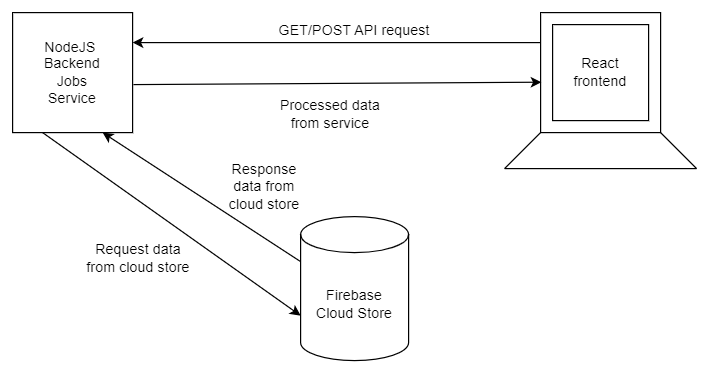

# 🚀🔥💰Fameo🥇😎🚀

## 🥇🤖Fastly Meet Employees💰🔥

## About Us

Fameo is new generation job portal. It connects employees and employers. Its USP is that it is 1 click apply for employees. So, its fast and efficient for employees. Also, for employers, they can see the applicant resume and decide to go further or not. Employees get job application status just on their dashboard.

## Features

1. New Generation Job portal

2. 1 Click Apply

3. Make Profile only once for employees

4. Realtime Job Application Status

5. Easy decision for employers

6. New Job Openings with full details

## Technology and Architecture

1. Frontend: React which calls NodeJS backend for rendering components on UI.
2. Backend: NodeJS calls Firestore Database and processes the data and sends it to the frontend.
3. Firestore DB: It is used for CRUD operations.

## Challenges I faced were:

1. Coming up with complete design within 2 days
2. Deploying NodeJS service as Firebase function
3. UI/UX design and implementation
